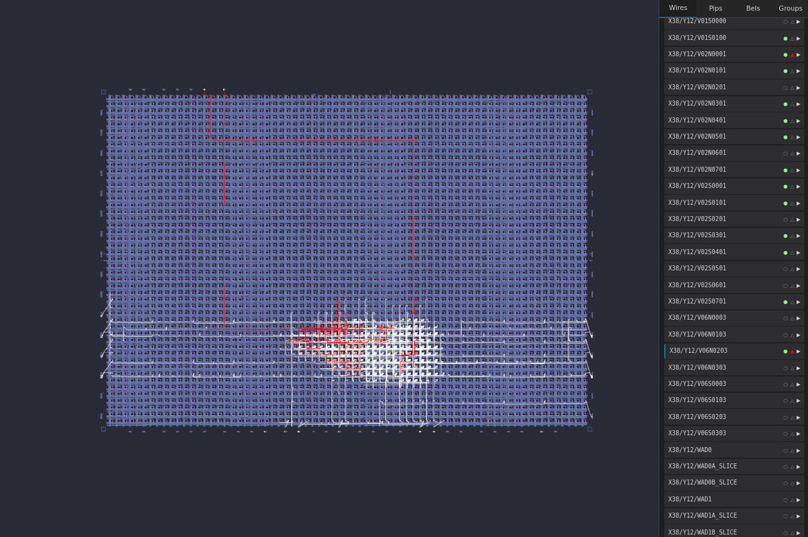

# Nextpnr Viewer

Interactive web-based FGPA viewer for [Nextpnr](https://github.com/YosysHQ/nextpnr).

## Features

- Supports most ECP5 & iCE40 chips
- Interactive: pan, zoom and select elements
- Wire, pip, bel and group element inspection
- Highlight active elements and critical paths

## Documentation

The documentation is available [here](docs/index.md).

## Contributing

We are open to contributions! Feel free to create a pull request and we'd be happy to review it.

Don't know where to start?
The [documentation](docs/index.md) contains resources that should help you get familiar with the code base.

## License

This project is available under the [MIT license](LICENSE.md). Note that some dependencies may have different licenses.

## EDAcation

Nextpnr Viewer is part of the [EDAcation](https://edacation.github.io) family!
Our goal is to build an easy to use environment for digital hardware design.
Check out some of our other projects below:

- [vscode-edacation](https://github.com/EDAcation/vscode-edacation) - VS Code extension
- [edacation](https://github.com/EDAcation/edacation) - Libary and CLI
- [native-fpga-tools](https://github.com/EDAcation/nextpnr-viewer) - Native FPGA tool bundles
